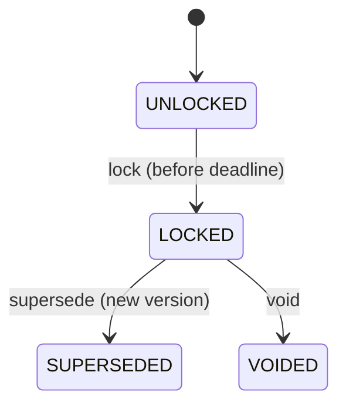

# HandiEdge Engine

A production-oriented **execution pipeline** for sports (MLB / NPB) game
predictions. It receives a validated **Control Tower** JSON payload and produces
a locked, auditable final prediction — or a safe `PASS` / `BLOCKED` when evidence
is missing, stale, contradictory, or below threshold. **The engine never
fabricates missing information.**

> ⚠️ **NON-PRODUCTION FALLBACK WARNING.** The bundled prediction model is a
> `DeterministicFallbackAdapter` marked `NON_PRODUCTION_FALLBACK`. It exists only
> to exercise the pipeline end to end. It is **not** a trained or validated model
> and must never be presented as one. Wire a real adapter before production use
> (see *Production model adapter integration guide*).

---

## 1. System purpose

Turn an upstream Control Tower handoff into an operational, lockable, settleable,
and auditable prediction for each game:

- normal winner + predicted loser, with win/loss probabilities
- handicap cover prediction (evaluated **independently** from the normal win)
- expected score, confidence tier, risk level
- explicit `PREDICT` / `PASS` / `BLOCKED` / `INVALID` decision with reasons
- supporting factors, risk factors, calibration notes, data-quality status
- prediction-lock, settlement-ready, and audit-trail metadata

The vertical slice is:

```mermaid
flowchart LR
  FE[Feature Engineering] --> CT[Control Tower payload]
  CT --> PE[Prediction Engine]
  PE --> CAL[Calibration]
  CAL --> DE[Decision Engine]
  DE --> AI[AI Multi-Agent Review]
  AI --> LK[Prediction Lock]
  LK --> ST[Settlement Engine]
  ST --> EA[Error Analysis Engine]
  EA --> SL[Self-Learning Engine]
```



The **AI Multi-Agent Review** (model-plan Step 9 / §4.5) is a final sanity check
between decisioning and lock. Three specialist reviewers — **Data Auditor**,
**Matchup Analyst**, and **Risk Reviewer** — examine the finished prediction and
its Control Tower context. Per the plan's invariant they may only **downgrade**
the confidence tier or attach warnings; they never rewrite a probability. The
review runs offline (deterministic guardrails) by default and upgrades to an LLM
reasoning pass automatically when `ANTHROPIC_API_KEY` is set — degrading back to
deterministic-only, never blocking a pick, if the model errors or refuses. Every
verdict, flag, and tier movement is persisted in the locked prediction and the
audit trail.

### Daily predictions (the personal-tool entry point)

`handiedge daily` is the one-command path from a real MLB date to predictions.
It runs the **Feature Engineering** front stage — fetch the day's slate and
probable starters from the public MLB Stats API, pull each starter's season
ERA/WHIP and each team's season wOBA (`app/domain/feature_engineering`), engineer
the model feature vector, and assemble a validated Control Tower payload — then
runs the full pipeline and prints a scannable daily report.

```bash
handiedge daily --date 2026-07-25            # today's card (human-readable)
handiedge daily --date 2026-07-25 --json     # raw prediction JSON
handiedge daily --cache-dir ./mlb-cache      # cache API responses on disk
```

Missing feeds are never faked: bullpen, park, weather, and market odds are
optional *enhancers* — their absence is recorded in `missing_features` and
surfaced by the AI Data Auditor, while starters + team offense drive the
core-signal completeness that gates a prediction. Wire an odds/weather lookup
into `DailySlateService` (or a trained XGBoost artifact via `model_artifact_dir`)
to raise confidence beyond the bundled non-production fallback.

## 2. Architecture & domain boundaries

Modular monolith with strict domain boundaries. Business logic lives in
`app/domain/*`; `app/services/*` orchestrate; `app/api` and `app/cli` are thin
adapters that call the **same** services (no duplicated logic).

```
app/
  core/           config, enums, exceptions, logging, ids, clock, hashing
  schemas/        Pydantic v2 contracts (control_tower, prediction, decision, ...)
  domain/
    handicap/     handicap parser — 1半 preserved distinctly (NOT 1.5)
    prediction/   adapter protocol, deterministic fallback, ensemble shell
    decision/     calibration, confidence tiers, handicap + decision engine
    ai_review/    Step 9 reviewers (data-auditor, matchup-analyst, risk-reviewer)
    settlement/   scope strategies + handicap rule registry
    error_analysis/  facts / metrics / hypotheses
    self_learning/   workflow state machine + gates
  services/       orchestration + one service per lifecycle stage
  repositories/   persistence gateways
  infrastructure/ db session/models, model-adapter registry
  api/ , cli/     transport layers
```

Key boundary rules:
- Model-specific logic is isolated behind `PredictionAdapter`.
- Handicap parsing/settlement is a dedicated bounded context with a **rule
  registry** (no giant conditionals).
- All Decision-Engine thresholds come from typed configuration (`core/config.py`).

## 3. Setup

### Claude Code on the web (automatic)

A `SessionStart` hook at the repository root (`.claude/hooks/session-start.sh`)
installs everything on session start, so tests and linters are runnable
immediately: the pnpm workspace plus the engine with its `dev` and `xgboost`
extras. It is idempotent, web-only (`CLAUDE_CODE_REMOTE`), and verifies the
toolchain imports before finishing. Run it manually with:

```bash
CLAUDE_CODE_REMOTE=true ./.claude/hooks/session-start.sh
```

### Local (SQLite)

```bash
cd handiedge_engine
python -m pip install -e ".[dev]"          # or: make install
cp .env.example .env                        # optional; SQLite works out of the box
export HANDIEDGE_DATABASE_URL="sqlite+pysqlite:///./handiedge.db"
python -m alembic upgrade head              # or: make migrate
python -m pytest                            # or: make test
```

## 4. Docker setup (PostgreSQL, production default)

```bash
docker compose up --build                   # Postgres + API running the REAL model
docker compose run --rm api alembic upgrade head
docker compose run --rm api pytest
```

The compose stack provides a `db` (Postgres 16) service with a persistent volume
and an `api` service whose entrypoint **migrates → trains the model artifact if
missing → serves**. The image bakes in the XGBoost extra
(`INSTALL_XGBOOST=true`), and the api service defaults to
`HANDIEDGE_MODEL_ADAPTER=xgboost`, so `docker compose up` runs the genuine model
(`fallback_used=false`) with the artifact persisted in the `handiedge_models`
volume. Verify what's live:

```bash
curl -s localhost:8000/api/v1/model    # -> is_production: true, model_id: xgboost-runs-mlb
```

For a slim fallback-only image, build with `--build-arg INSTALL_XGBOOST=false`
and set `HANDIEDGE_MODEL_ADAPTER=fallback`.

## 4b. Where the production model runs

| Target | Command | Runs the real model? |
|---|---|---|
| **Docker (compose)** | `docker compose up --build` | ✅ yes — entrypoint trains-if-missing, `/api/v1/model` confirms |
| **Local Python** | `make install-xgboost && make train-xgboost && make predict-xgboost` | ✅ yes (reproducible, seeded) |
| **Local API** | set the `HANDIEDGE_MODEL_ADAPTER=xgboost` env vars, then `make run` | ✅ yes |
| **Fallback anywhere** | default (`HANDIEDGE_MODEL_ADAPTER=fallback`) | ❌ NON-PRODUCTION fallback |

The trained `.ubj` artifacts are reproducible from the seeded training script and
are **git-ignored**; a fresh clone regenerates them via any of the paths above.
The bundled model is trained on **synthetic** data — replace the training data
loader for genuine predictive power (see section 12).

## 5. Environment variables

See `.env.example`. Highlights (all prefixed `HANDIEDGE_`):

| Variable | Purpose | Default |
|---|---|---|
| `DATABASE_URL` | SQLAlchemy URL (SQLite local, Postgres prod) | SQLite file |
| `REQUIRE_API_KEY` / `API_KEY` | Minimal MVP auth | off |
| `MAX_REQUEST_BYTES` / `MAX_GAMES_PER_RUN` | Input size limits | 2 MB / 40 |
| `GATE_MIN_PREDICTION_PROBABILITY` | Min calibrated prob to predict | 0.50 |
| `GATE_MIN_HANDICAP_COVER_PROBABILITY` | Min handicap cover to predict | 0.52 |
| `GATE_BLOCK_UNRESOLVED_HANDICAP` | Block locking unresolved handicaps | true |

Secrets are read from the environment only — never committed.

## 6. Database migration

Alembic drives schema. Revision `0001_initial` builds all tables (prediction_runs,
control_tower_payloads, game_predictions, decision_records, calibration_records,
prediction_locks, settlement_records, error_analysis_records, learning_workflows,
dataset/feature/model versions, model_registry_entries, audit_events).

```bash
python -m alembic upgrade head
python -m alembic downgrade base   # tear down
```

## 7. API usage

Run the API: `make run` (or `uvicorn app.main:app --reload`). OpenAPI at `/docs`.

| Method & path | Purpose |
|---|---|
| `GET /health`, `GET /ready` | liveness / readiness |
| `GET /api/v1/model` | which adapter is live (production vs fallback) |
| `POST /api/v1/predictions/run` | run the pipeline (idempotent by run_id+hash) |
| `GET /api/v1/predictions/runs/{run_id}` | fetch a run result |
| `GET /api/v1/predictions/{prediction_id}` | fetch a single prediction |
| `POST /api/v1/predictions/{prediction_id}/lock` | lock a prediction |
| `GET /api/v1/locks/{prediction_lock_id}` | fetch a lock |
| `POST /api/v1/settlements` | settle a locked prediction |
| `GET /api/v1/settlements/{settlement_id}` | fetch a settlement |
| `POST /api/v1/error-analysis/{settlement_id}` | generate error analysis |
| `GET /api/v1/error-analysis/{error_analysis_id}` | fetch error analysis |
| `POST /api/v1/learning/workflows` | create a learning workflow |
| `GET /api/v1/learning/workflows/{workflow_id}` | fetch workflow |
| `POST /api/v1/learning/workflows/{workflow_id}/advance` | advance a stage |

All errors use a consistent envelope: `error_code`, `message`, `details`,
`correlation_id`, `timestamp`.

## 8. CLI usage

The CLI calls the same services as the API.

```bash
handiedge validate-control-tower examples/control_tower_valid.json
handiedge predict examples/control_tower_valid.json
handiedge lock <PREDICTION_ID>
handiedge settle <SETTLEMENT_INPUT.json>
handiedge analyze-error <SETTLEMENT_ID>
handiedge create-learning-workflow <SETTLEMENT_ID> --league MLB
```

`scripts/run_e2e.sh` runs the whole chain on SQLite.

## 9. Sample request / response

Request: [`examples/control_tower_valid.json`](examples/control_tower_valid.json).
Response: [`examples/prediction_output.json`](examples/prediction_output.json)
(regenerated by `handiedge predict`). It follows the Output Contract exactly:
`schema_version, run_id, league, control_tower_status, prediction_status,
model_context, calibration_context, games[], summary`.

## 10. Lifecycles

**Prediction lifecycle** (single transaction):
`validate → persist payload → predict → calibrate → decide → response`.
Locking, settlement, error analysis, and learning are explicit later operations.

**Lock lifecycle:**



Locks are immutable — corrections create a **new version** and mark the prior
lock `SUPERSEDED`. Late submissions (past `prediction_deadline`) are rejected.
Duplicate lock calls are idempotent. A settlement must reference a valid lock.

**Settlement lifecycle:** deterministic and rerunnable. Identical inputs are
idempotent; a conflicting official result raises a `SETTLEMENT_CONFLICT` and logs
an audit event instead of overwriting. Scope rules:
- `MLB_FINAL_INCL_EXTRA` — final score **including extra innings**.
- `NPB_REG9_ONLY` — **regulation nine innings only** (regulation ties → PUSH).
Postponed / cancelled / suspended / no-contest / in-progress → `VOID`.

**Error-analysis lifecycle:** after settlement, computes prediction error, Brier
and log-loss contributions, calibration bucket, margin error; separates observed
facts, derived metrics, and hypotheses (each with a confidence). Insufficient
evidence → `UNKNOWN`, never a guessed cause.

**Self-learning lifecycle:** a controlled state machine — never auto-retrains
and deploys per game.

```mermaid
stateDiagram-v2
  [*] --> PENDING_DATA
  PENDING_DATA --> DATA_VALIDATED
  DATA_VALIDATED --> LEAKAGE_CHECKED
  LEAKAGE_CHECKED --> READY_FOR_TRAINING
  READY_FOR_TRAINING --> TRAINING --> BACKTESTING --> OOS_VALIDATION
  OOS_VALIDATION --> CALIBRATION_VALIDATION --> CHALLENGER_READY
  CHALLENGER_READY --> APPROVAL_REQUIRED
  APPROVAL_REQUIRED --> APPROVED --> DEPLOYED
  APPROVAL_REQUIRED --> REJECTED
```

Gates enforce: no training on unsettled games, no future/same-day leakage,
minimum sample size, full evaluation battery (Brier, log-loss, calibration error,
accuracy, handicap accuracy) before challenger readiness, and **explicit human
approval with a Brier improvement over champion** before promotion.

## 11. Handicap integrity & limitations

The handicap is a bounded context. Supported notations: `0`, `0.x`, `1.0`,
`1.x`, `1半` (JP_HALF), `1半1`…`1半9` (JP_HALF_SUB).

- **`1半` is never normalized to `1.5`.** `handicap_value` is `null` for JP_HALF;
  it settles as an even **split** across integer lines `{base, base+1}`. At a
  favorite margin of exactly `base+1` a split yields a **partial win** whereas a
  decimal `1.5` yields a full win — so conflating them would misprice results.
- `1半n` settles as a weighted split `{base:(10−n)/10, base+1:n/10}`.
- Unsupported / ambiguous / incomplete notation → `UNRESOLVED`: it does **not**
  guess, it blocks handicap locking, and lets the normal win prediction continue
  if its own data is valid.

**Assumption (documented):** the exact book-specific semantics of `1半n`
weighting are a conservative interpretation chosen so results are deterministic
and distinct from decimals. Replace `app/domain/settlement/handicap_rules.py`
strategies to match a specific book's rulebook.

## 12. Production model adapter (XGBoost)

A real production adapter is included: **`XGBoostModelAdapter`**
(`app/infrastructure/model_adapters/xgboost_adapter.py`). It uses two trained
XGBoost `count:poisson` regressors to predict each team's **expected runs**, then
derives the full integer **margin distribution** and a self-consistent moneyline
from an independent-Poisson score model (`app/domain/prediction/poisson.py`). The
normal-win probability and the handicap cover probability therefore come from the
*same* distribution — the handicap is never a copy of the moneyline.

Enable it (xgboost/numpy are an optional extra so the core engine runs without them):

```bash
make install-xgboost                       # pip install -e ".[xgboost]"
make train-xgboost                         # writes artifacts/xgboost_mlb/ (seeded, reproducible)
make predict-xgboost                       # runs the pipeline through the trained model
```

Or via environment:

```bash
export HANDIEDGE_MODEL_ADAPTER=xgboost
export HANDIEDGE_MODEL_ARTIFACT_DIR=artifacts/xgboost_mlb
export HANDIEDGE_CALIBRATION_ARTIFACT_PATH=artifacts/xgboost_mlb/calibration.json
```

The training script (`scripts/train_xgboost.py`) trains both regressors, computes
feature medians, **fits a Platt calibrator** on a holdout, and writes a
self-contained artifact bundle:

```
artifacts/xgboost_mlb/
  metadata.json     model id/version, feature_version, feature_names, medians, max_runs
  home_runs.ubj     home expected-runs booster
  away_runs.ubj     away expected-runs booster
  calibration.json  fitted Platt (a, b) — loaded as CALIBRATED, not UNCALIBRATED
```

**Feature contract** — `app/domain/prediction/features.py::FEATURE_NAMES` is the
integration point. Extraction is deterministic; a missing feature is **flagged as
a warning** and substituted with the artifact's training median (a documented,
degraded mode) rather than silently imputed. The Decision Engine's
evidence-completeness gate then decides whether to `PASS`.

**Register a custom adapter** with `register_adapter("default", MyAdapter())` if you
need something other than the XGBoost/Poisson design.

## 12b. Training on real MLB history (leakage-safe)

Training on real data is a **two-step** flow: one networked build, then fully
offline, reproducible training.

```bash
# 1) Fetch real history once (cached to .mlb_cache/, exported as JSONL)
python scripts/build_dataset.py --start 2023-04-01 --end 2023-09-30 \
    --out datasets/mlb_2023.jsonl

# 2) Train from the export — no network needed, repeatable
python scripts/train_xgboost.py --source dataset --dataset datasets/mlb_2023.jsonl \
    --out artifacts/xgboost_mlb --model-version 2.0.0
```

**Source**: the public MLB Stats API (`statsapi.mlb.com`, no auth) — schedule with
linescore + probable pitchers, plus per-game boxscores. Only games in a final
state are ingested; postponed/in-progress games are skipped. The linescore also
yields a **regulation-nine score distinct from the extra-innings final**, which is
what makes `NPB_REG9_ONLY` settlement expressible rather than approximated.

**Leakage safety** (`app/domain/prediction/dataset.py`) — the property that
matters most, and it is enforced structurally, not by convention:

- games are processed in strict chronological order, grouped by date;
- features for a game on date *D* are computed from state containing only games
  with `game_date < D`;
- that date's results are folded into the state **only after** all its rows are
  emitted — so same-date games can never inform one another (exactly the
  `same_day_contamination` condition the Self-Learning gate checks);
- the train/validation split is a **chronological prefix** (past → future), and
  imputation medians are computed from the **training split only**.

These are asserted by tests that mutate future games and require earlier rows to
be bit-identical (`tests/unit/test_dataset_builder.py`).

**Feature sourcing.** Eleven of the fourteen contract features are derived as-of
from schedule/boxscore history (starter ERA/WHIP, team wOBA from boxscore batting
lines, bullpen ERA, rest days, rolling park factor). The remaining three come
from external feeds — enable them with the flags below to reach **14/14 coverage**:

```bash
python scripts/build_dataset.py --start 2023-04-01 --end 2023-09-30 \
    --out datasets/mlb_2023.jsonl \
    --weather \                          # temp_f + wind_mph  (free, no key)
    --odds-csv datasets/closing_odds.csv # implied_home_win_probability
```

| Feature | Source | Notes |
|---|---|---|
| `temp_f`, `wind_mph` | Open-Meteo **archive** API (free, no auth) | venue coordinates from MLB `/venues`; hourly reading nearest first pitch (`--first-pitch-hour`) |
| `implied_home_win_probability` | your closing-odds export (`--odds-csv`) or The Odds API (`--odds-api`, needs `ODDS_API_KEY`) | always **vig-free** |

Without a flag the feature stays `None` — **never invented** — and the trained
artifact records it under `unsourced_features`, which is **measured from the
training split** rather than assumed, so a feature you genuinely supplied is never
mislabelled inert.

*Odds CSV format* (`odds_style` is `american` by default, or `decimal`; you may
instead supply a ready `implied_home_win_probability` column):

```csv
game_date,home_team,away_team,home_odds,away_odds
2024-07-04,New York Yankees,Boston Red Sox,-160,140
```

De-vigging matters: raw book probabilities sum to more than 1, so feeding the raw
number would bake the bookmaker's margin into the feature. Both sources normalize
home+away to 1.

⚠️ **Observed-vs-forecast assumption.** The weather source returns the *observed*
conditions at game time, whereas live inference only has a *forecast*. That is a
mild optimistic assumption — common in baseball modelling, but real. It is
recorded in the dataset manifest as `weather_mode: observed`. To remove it, source
archived forecasts instead. Odds use the **closing (pre-game)** line, so they are
inputs rather than look-ahead.

The artifact metadata carries provenance so a model's pedigree is auditable:

```json
{ "data_source": "dataset", "dataset_path": "datasets/mlb_2023.jsonl",
  "split": "time_based_prefix_80_20",
  "unsourced_features": ["temp_f", "wind_mph", "implied_home_win_probability"] }
```

A model trained with `"data_source": "synthetic"` has **no real predictive
power** — it exercises the machinery only.

The bundled `DeterministicFallbackAdapter` remains available
(`HANDIEDGE_MODEL_ADAPTER=fallback`, the default) for tests and local runs, and is
always reported with `fallback_used=true`.

## 13. Security & auth

MVP auth is a minimal API-key header (`x-api-key`), disabled unless
`HANDIEDGE_REQUIRE_API_KEY=true`. **For production, replace it** with a real
mechanism (OIDC/JWT at an API gateway, mTLS between services, or a signed-request
scheme) implemented in `app/api/dependencies.py::require_api_key`. Other controls
in place: request-size limits, correlation IDs, structured JSON logging,
transaction rollback, immutable locked records, deterministic serialization.

## 14. Troubleshooting

| Symptom | Cause / fix |
|---|---|
| `CONTROL_TOWER_REJECTED` (422) | payload failed schema rules; see `details.errors` |
| `IDEMPOTENCY_CONFLICT` (409) | same `run_id`, different payload hash |
| `LOCK_DEADLINE_EXCEEDED` (409) | locking after `prediction_deadline` |
| `SETTLEMENT_CONFLICT` (409) | different official result for a settled lock |
| handicap `UNAVAILABLE` | adapter returned no margin distribution |
| handicap `BLOCKED` | notation `UNRESOLVED` (e.g. `1半X`) |
| `no such table` | run `alembic upgrade head` |

## 15. Known limitations

- The **default** adapter is a NON-PRODUCTION deterministic fallback. A real
  `XGBoostModelAdapter` is included (section 12); train it on real history via
  `make build-dataset && make train-real` (section 12b) before production use —
  a `synthetic`-provenance artifact has no predictive power.
- The MLB Stats API loader's parsers and the leakage-safe builder are unit-tested
  against recorded fixtures, but **the live network fetch has not been executed
  in this environment** (egress to `statsapi.mlb.com` is blocked here). Run
  `make build-dataset` once from a network-enabled environment to validate the
  live path end to end.
- `temp_f` and `wind_mph` come from **observed** archive weather, a mild
  optimistic assumption versus the forecast available at prediction time
  (`weather_mode: observed` in the manifest).
- Historical odds have no free public feed: supply your own licensed closing-line
  export (`--odds-csv`) or a paid `ODDS_API_KEY` (`--odds-api`). Without either,
  `implied_home_win_probability` stays inert.
- Real-data training covers **MLB only**; NPB has no equivalent public feed, so
  an NPB model needs its own data source.
- Calibration defaults to identity (reported `UNCALIBRATED`) until a fitted
  artifact is supplied; the XGBoost path ships a fitted Platt calibrator.
- `1半n` weighting is a documented conservative interpretation, not a specific
  book's official rulebook.
- Self-learning training is delegated to a test adapter for the MVP; the control
  flow, gates, persistence, and registry behavior are functional.
- Auth is a minimal API-key stub for the MVP.

## 16. Next production integration steps

1. Replace the fallback adapter with a trained model (+ margin distribution).
2. Fit and load Platt/Isotonic calibrators from the model registry.
3. Confirm book-specific handicap settlement semantics for `1半n`.
4. Swap MVP auth for gateway/mTLS auth.
5. Wire the self-learning trainer adapter to a real training/backtesting job.
6. Point `HANDIEDGE_DATABASE_URL` at managed PostgreSQL; run migrations in CI/CD.
